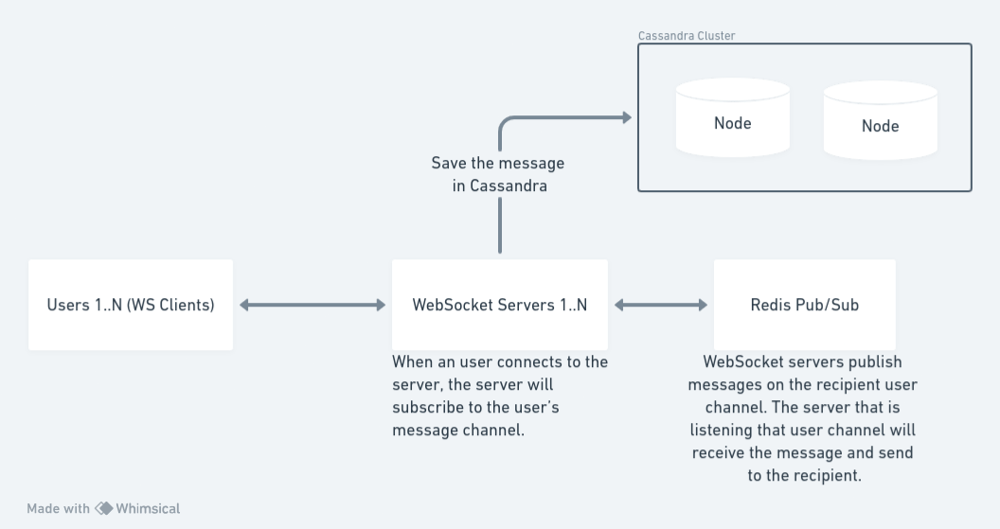

# Introduction

This is a simple test application that uses redis, cassandra and websocket servers to simulate a chat system with multiple websocket servers.



# Pre requisites
- Docker
- Node.js 20 or higher

# How to execute

```bash
# Install project dependencies
npm ci

# Run a Redis docker container
docker run --name redis -p 6379:6379 -d redis

# Create a docker network for Cassandra cluster
docker network create -d bridge cassandra-network

# Run 2 nodes of Cassandra
docker run --name cassandra --network cassandra-network -d cassandra
docker run --name cassandra2 -d --network cassandra-network -e CASSANDRA_SEEDS=cassandra cassandra

# Now, it is necessary to create the Cassandra keyspace and table, In order to do that
# I used a VSCode plugin (SQLTools Cassandra) to connect to Cassandra and execute the fallowing commands
# The default username is "cassandra" and the default password is also "cassandra"
# Inspect the Cassandra Docker container to get the IPAddress inside NetworkSettings to be able to connect to Cassandra
docker inspect cassandra

# Create Cassandra keyspace 
CREATE KEYSPACE messages WITH replication = {
'class':'SimpleStrategy',
'replication_factor':1
};

# Create Cassandra table
CREATE TABLE messages.messages (
  id UUID PRIMARY KEY,
  authorId INT,
  recipientId INT,
  content TEXT,
  createdAt TIMESTAMP
)

# Lets create our WebSocket servers
# In one terminal tab, execute
WEB_SOCKET_PORT=3000 node server.js

# In another terminal tab, execute
WEB_SOCKET_PORT=3001 node server.js

# In another terminal tab, we are going to create our ws clients and send the messages from one user to another
node ws-clients.js

# Execute the fallowing command to see the content of the Cassandra messages table
SELECT * FROM messages.messages

```

